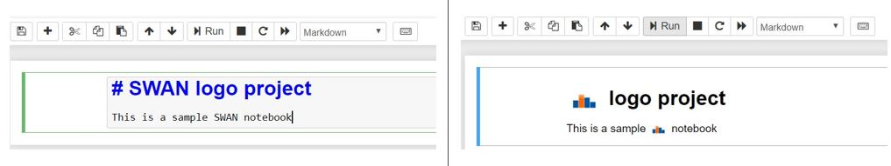

# About

This extension replaces all the "SWAN" strings which are located inside markdown cells (inside a Notebook) with the SWAN logo.



## Prerequisites

- Python
- Jupyter

## Instructions

```bash
    pip install jupyter_contrib_nbextensions
    jupyter contrib nbextension install
    jupyter nbextension install swan_logo
```
