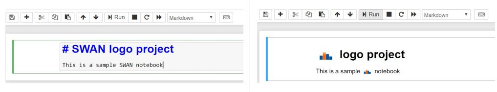

# SWAN Logo

This extension replaces all the "SWAN" strings which are located inside markdown cells (inside a Notebook) with the SWAN logo.

## Usage

When enabled, this extensions automatically converts the "SWAN" strings located inside markdown cells with the SWAN logo. When a new markdown cell is created, the output of the cell is converted once you run it.

## Internals

This extension makes use of two event handlers. One of them is responsible for updating the existing content upon loading the notebook, while the other one processes the markdown cell outputs as and when a new cell is executed. While processing, all the childNodes of the cell element are traversed and the image is injected in the place of the string "SWAN".

## About

This extension is made for the purpose of evaluation of the exercise https://gitlab.cern.ch/swan/projects/gsoc-2019.

- Developer: Akash Ravi
- Email ID: akashkravi@gmail.com
